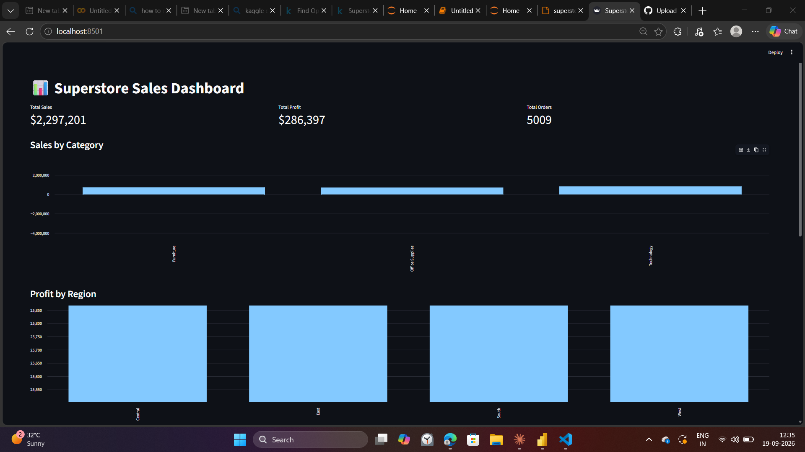

# 📊 Superstore Sales Analysis

An end-to-end data analysis project exploring sales, profit, and regional performance using the Kaggle Superstore dataset — covering data cleaning, exploratory analysis, visualization, and an interactive dashboard.

## 🎯 Objective
Analyze a global superstore's sales data to uncover which products, regions, and customer segments drive revenue and profit — and identify where discounting is hurting profitability.

## 📁 Dataset
- **Source:** [Superstore Dataset (Kaggle)](https://www.kaggle.com/datasets/vivek468/superstore-dataset-final)
- **Size:** 9,994 rows, 21 columns
- **Time range:** 2014–2017
- **Includes:** Order details, product categories, sales, profit, discount, customer segment, region, shipping info

The raw CSV isn't included in this repo (Kaggle licensing) — download it from the link above and place it in `data/superstore.csv` to reproduce this analysis.

## 🛠 Tools & Libraries
- **Python** — pandas, numpy for data manipulation
- **Matplotlib & Seaborn** — data visualization
- **Jupyter Notebook** — exploratory analysis
- **Streamlit** — interactive dashboard

## 🧹 Data Cleaning
- Converted `Order Date` and `Ship Date` to proper datetime format
- Checked and removed duplicate rows
- Verified no missing values across the dataset

## 📈 Key Insights
- [Fill in with your actual numbers once you run the analysis, e.g.:]
- Technology and Office Supplies generate the highest total sales
- The West region delivers the strongest profit margins
- Discounts above 30% frequently correlate with negative profit — a clear signal to review discount policy
- Sales peak in November–December, suggesting seasonal demand

## 📊 Dashboard


Run the interactive version locally:
```bash
cd dashboard
streamlit run app.py
```

## 📂 Project Structure

sales_report/
├── data/
│ └── superstore.csv # (not included — download from Kaggle)
├── notebook.ipynb # full exploratory analysis
├── dashboard/
│ └── app.py # Streamlit dashboard
├── report.md # written insights report
└── README.md

## 🚀 How to Run
1. Clone this repo
```bash
   git clone https://github.com/akashkumar223/sales_report.git
   cd sales_report
```
2. Install dependencies
```bash
   pip install pandas numpy matplotlib seaborn jupyter streamlit
```
3. Download the dataset from Kaggle and place it in `data/superstore.csv`
4. Open the notebook
```bash
   jupyter notebook notebook.ipynb
```
5. Or launch the dashboard directly
```bash
   cd dashboard
   streamlit run app.py
```

## 👤 Author
Akash Kumar
